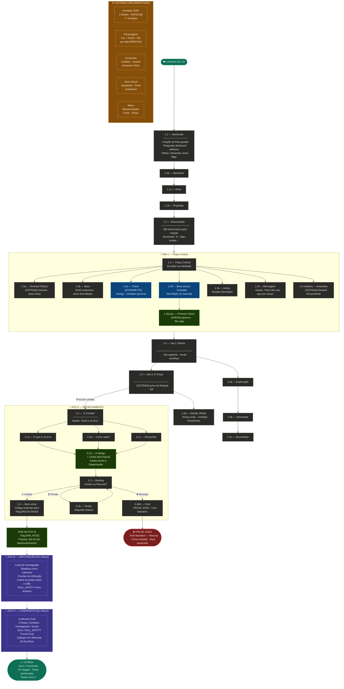

```mermaid
flowchart TD

%% ══════════════════════════════════════════════════════
%% INÍCIO
%% ══════════════════════════════════════════════════════
    START([🎮 LENDAS DO LDI])
    START --> C11

%% ══════════════════════════════════════════════════════
%% ATO I — ENTRADA
%% ══════════════════════════════════════════════════════

    C11["1.1 — NeoGuide
    ──────────────
    Criação de ficha guiada
    Perguntas distribuem atributos
    Define: elemental, arma, flags"]

    C11 --> C11b["1.1b — Elemento"]
    C11b --> C11c["1.1c — Arma"]
    C11c --> C11d["1.1d — Propósito"]
    C11d --> C12

    C12["1.2 — Desconexão
    ────────────────
    SBI desconecta após criação
    NeoGuide: 'A—Algo... errado...'"]

    C12 --> DIA1

    subgraph DIA1["📅 DIA 1 — Praça Central"]
        direction TB
        
        C13["1.3 — Praça Central
        Escolha sua atividade"]

        C13 --> C13a["1.3a — Terminal Público
        [SISTEMA] missões · pista inicial"]
        C13 --> C13b["1.3b — Beco
        Robô misterioso · aviso StormBytes"]
        C13 --> C13c["1.3c — Treino
        [STORMBYTE] inimigo · combate opcional"]
        C13 --> C13d["1.3d — Beco escuro
        Combate StormByte_91 (tutorial)"]

        C13d --> C13d_pos["1.3d-pos — Primeira Vitória
        [KAEDA] aparece · 'Me siga'"]
        
        C13 --> C13e["1.3e — Arena
        Desafio StormByte"]
        C13 --> C13f["1.3f — Mensagem
        Kaeda: 'Você não caiu aqui por acaso'"]
        C13 --> C13_mafama["1.3-mafama — Assombro
        [SISTEMA] Ranked Kill pendente"]
    end

    DIA1 --> C14

    C14["1.4 — Dia 2: Rotina
    ────────────────────
    Dia seguinte · novas escolhas"]

    C14 --> C14a["1.4a — Exploração"]
    C14a --> C14b["1.4b — Informante"]
    C14b --> C14c["1.4c — Esconderijo"]

    C14 --> C15

    C15["1.5 — Dia 3: O Prazo
    ────────────────────
    [SISTEMA] aviso de Ranked Kill"]

    C15 --> C15a["1.5a — Missão Oficial
    Arena Leste · combate GhostPulse"]

    C15 -->|"Procurar contato"| C21

%% ══════════════════════════════════════════════════════
%% ATO II — RECRUTAMENTO
%% ══════════════════════════════════════════════════════

    subgraph ATO2["📅 ATO II — RECRUTAMENTO"]
        direction TB

        C21["2.1 — O Contato
        ──────────────
        Kaeda: 'Você é um Eco'"]

        C21 --> C21a["2.1a — O que é um Eco"]
        C21 --> C21b["2.1b — Como sabe?"]
        C21 --> C21c["2.1c — Desconfiar"]

        C21a & C21b & C21c --> C21d

        C21d["2.1d — O Abrigo
        ⭐ CENA DESTAQUE
        Kaeda revela a Organização"]

        C21d --> C22["2.2 — Briefing
        Aceitar ou Recusar?"]

        C22 -->|"✅ Aceitar"| C23["2.3 — Bem-vindo
        Código Anômalo Ativo
        Flag [RECRUTADO]"]
        
        C22 -->|"⏳ Pensar"| C22b["2.2b — Tempo
        Segunda chance"]
        C22b --> C22

        C22 -->|"❌ Recusar"| C24fim["2.4fim — Fork
        FIM DE JOGO · Fork Narrativo"]
    end

    C23 --> FIM_ATO2["[FIM DO ATO II]
        Flag [FIM_ATO2]
        Próximo: Ato III (em desenvolvimento)"]

    C24fim --> FDJ_FORK

    FDJ_FORK(["❌ FIM DE JOGO
    Fork Narrativo — Recusa
    Ficha mantida · Save arquivado"])

%% ══════════════════════════════════════════════════════
%% ATO III — EM BREVE
%% ══════════════════════════════════════════════════════

    subgraph ATO3["🔮 ATO III — INFILTRAÇÃO (Em Breve)"]
        direction TB
        A3_PREV["Loop de Investigação
        Batalhas como cobertura
        Puzzles de infiltração
        Coleta de pistas sobre o vilão
        NULL_ENTITY como ameaça"]
    end

    FIM_ATO2 -.-> ATO3

%% ══════════════════════════════════════════════════════
%% ATO IV — EM BREVE
%% ══════════════════════════════════════════════════════

    subgraph ATO4["🔮 ATO IV — CONFRONTO (Em Breve)"]
        direction TB
        A4_PREV["Confronto Final
        3 Rotas: Combate / Investigação / Social
        Boss: NULL_ENTITY Forma Final
        Epílogo com Memória de Escolhas"]
    end

    ATO3 -.-> ATO4
    ATO4 --> FIM_VITORIA

    FIM_VITORIA(["✅ VITÓRIA
    Arco 1 Concluído
    XP integral · Ficha preservada
    Teaser Arco 2"])

%% ══════════════════════════════════════════════════════
%% SISTEMAS CRUZADOS
%% ══════════════════════════════════════════════════════

    subgraph SISTEMAS["⚙️ SISTEMAS IMPLEMENTADOS"]
        direction LR
        S1["Combate 3D&T
        3 Modos · FA/FD/1d6
        7+ inimigos"]
        S2["Personagem
        Cor + Fonte + BG
        por fala [PREFIXO]"]
        S3["Economia
        Créditos · Gastos
        semanais 410cr"]
        S4["Save Cloud
        Supabase · Ficha
        reutilizável"]
        S5["Menu
        Manual Drawer
        Ficha · Pistas"]
    end

%% ══════════════════════════════════════════════════════
%% ESTILOS
%% ══════════════════════════════════════════════════════

    classDef inicio fill:#0F6E56,stroke:#1D9E75,color:#E1F5EE
    classDef cena fill:#2A2A28,stroke:#666660,color:#E8E6DF
    classDef combate fill:#0C447C,stroke:#378ADD,color:#E6F1FB
    classDef destaque fill:#1A3B08,stroke:#7AB040,color:#E8F3D4
    classDef fdj fill:#791F1F,stroke:#E24B4A,color:#FCEBEB
    classDef futuro fill:#3C3489,stroke:#7F77DD,color:#EEEDFE
    classDef sistemas fill:#854F0B,stroke:#EF9F27,color:#FAEEDA
    classDef vitoria fill:#0F6E56,stroke:#1D9E75,color:#E1F5EE

    class START inicio
    class C11,C11b,C11c,C11d,C12,C13,C13a,C13b,C13e,C13f,C13_mafama,C14,C14a,C14b,C14c,C15,C15a,C21,C21a,C21b,C21c,C21d,C22,C22b,C23,C24fim cena
    class C13c,C13d combate
    class C13d_pos,C21d destaque
    class FDJ_FORK fdj
    class ATO3,ATO4,A3_PREV,A4_PREV futuro
    class SISTEMAS,S1,S2,S3,S4,S5 sistemas
    class FIM_VITORIA vitoria
    class FIM_ATO2 destaque
```
