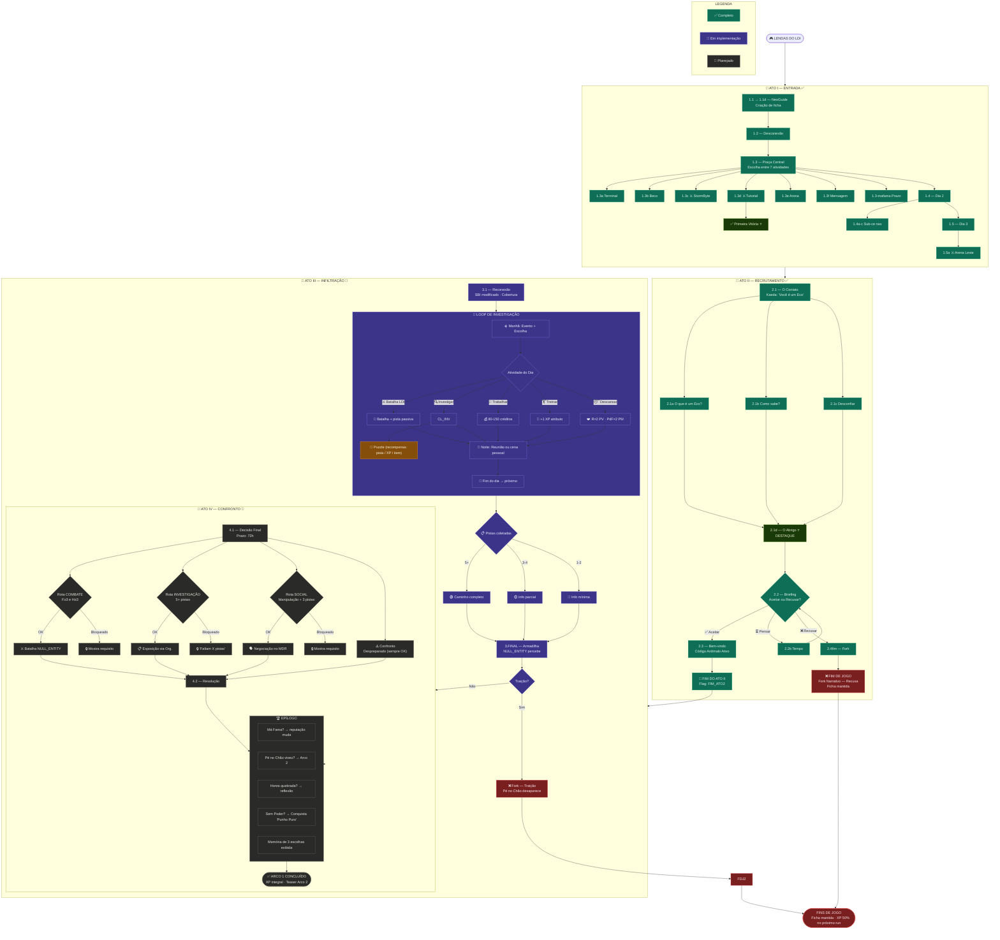

```mermaid
flowchart TD

%% ══════════════════════════════════════════════════════
%% INÍCIO
%% ══════════════════════════════════════════════════════
    START([🎮 LENDAS DO LDI])
    START --> ATO1

%% ══════════════════════════════════════════════════════
%% ATO I ✅ COMPLETO
%% ══════════════════════════════════════════════════════

    subgraph ATO1["📗 ATO I — ENTRADA ✅"]
        direction TB
        
        C11["1.1 → 1.1d — NeoGuide
        Criação de ficha"]
        C11 --> C12["1.2 — Desconexão"]
        
        C12 --> C13["1.3 — Praça Central
        Escolha entre 7 atividades"]
        
        C13 --> C13a["1.3a Terminal"]
        C13 --> C13b["1.3b Beco"]
        C13 --> C13c["1.3c ⚔️ StormByte"]
        C13 --> C13d["1.3d ⚔️ Tutorial"]
        C13d --> C13d_pos["✅ Primeira Vitória ⭐"]
        C13 --> C13e["1.3e Arena"]
        C13 --> C13f["1.3f Mensagem"]
        C13 --> C13_maf["1.3-mafama Prazo"]
        
        C13 --> C14["1.4 — Dia 2"]
        C14 --> C14a["1.4a-c Sub-ce nas"]
        C14 --> C15["1.5 — Dia 3"]
        C15 --> C15a["1.5a ⚔️ Arena Leste"]
    end

    ATO1 --> ATO2

%% ══════════════════════════════════════════════════════
%% ATO II ✅ COMPLETO
%% ══════════════════════════════════════════════════════

    subgraph ATO2["📕 ATO II — RECRUTAMENTO ✅"]
        direction TB
        
        C21["2.1 — O Contato
        Kaeda: 'Você é um Eco'"]
        C21 --> C21a["2.1a O que é um Eco?"]
        C21 --> C21b["2.1b Como sabe?"]
        C21 --> C21c["2.1c Desconfiar"]
        
        C21a & C21b & C21c --> C21d["2.1d — O Abrigo ⭐
        DESTAQUE"]
        
        C21d --> C22{"2.2 — Briefing
        Aceitar ou Recusar?"}
        
        C22 -->|"✅ Aceitar"| C23["2.3 — Bem-vindo
        Código Anômalo Ativo"]
        C22 -->|"⏳ Pensar"| C22b["2.2b Tempo"]
        C22b --> C22
        C22 -->|"❌ Recusar"| C24f["2.4fim — Fork"]
        
        C23 --> FIM_ATO2["🏁 FIM DO ATO II
        Flag: FIM_ATO2"]
        
        C24f --> FDJ1["❌ FIM DE JOGO
        Fork Narrativo — Recusa 
        Ficha mantida"]
    end

    FIM_ATO2 --> ATO3

%% ══════════════════════════════════════════════════════
%% ATO III 🔄 EM IMPLEMENTAÇÃO
%% ══════════════════════════════════════════════════════

    subgraph ATO3["📘 ATO III — INFILTRAÇÃO 🔄"]
        direction TB
        
        C31["3.1 — Reconexão
        SBI modificado · Cobertura"]
        
        C31 --> LOOP_DIARIO
        
        subgraph LOOP_DIARIO["🔄 LOOP DE INVESTIGAÇÃO"]
            direction TB
            
            CL_M["☀️ Manhã: Evento + Escolha"]
            
            CL_M --> CL_ATV{"Atividade do Dia"}
            
            CL_ATV -->|"⚔️ Batalha LDI"| CL_BAT
            CL_ATV -->|"🔍 Investigar"| CL_INV
            CL_ATV -->|"💼 Trabalhar"| CL_TRAB
            CL_ATV -->|"🏋️ Treinar"| CL_TREI
            CL_ATV -->|"😴 Descansar"| CL_DESC
            
            CL_BAT["🧩 Batalha + pista passiva"]
            CL_INV --> CL_PUZ["🧩 Puzzle (recompensa: pista / XP / item)"]
            CL_TRAB["💰 80-150 créditos"]
            CL_TREI["💪 +1 XP atributo"]
            CL_DESC["❤️ R×2 PV · PdF×2 PM"]
            
            CL_BAT & CL_INV & CL_TRAB & CL_TREI & CL_DESC --> CL_N["🌙 Noite: Reunião ou cena pessoal"]
            CL_N --> CL_FIM["📅 Fim do dia → próximo"]
        end
        
        LOOP_DIARIO --> ANALISE{"📋 Pistas coletadas"}
        ANALISE -->|"5+"| COMPLETO["🟢 Caminho completo"]
        ANALISE -->|"3-4"| PARCIAL["🟡 Info parcial"]
        ANALISE -->|"1-2"| MINIMO["🔴 Info mínima"]
        
        COMPLETO & PARCIAL & MINIMO --> C3F["3.FINAL — Armadilha
        NULL_ENTITY percebe"]
        
        C3F --> TRAICAO{"Traição?"}
        TRAICAO -->|"Não"| ATO4
        TRAICAO -->|"Sim"| FDJ_TRAI["❌ Fork — Traição
        Pé no Chão desaparece"]
    end

    ATO3 --> ATO4
    FDJ_TRAI --> FDJ2

%% ══════════════════════════════════════════════════════
%% ATO IV 📅 PLANEJADO
%% ══════════════════════════════════════════════════════

    subgraph ATO4["📙 ATO IV — CONFRONTO 📅"]
        direction TB
        
        C41["4.1 — Decisão Final
        Prazo: 72h"]
        
        C41 --> ROTA1{"Rota COMBATE
        F≥3 e H≥3"}
        ROTA1 -->|"OK"| R1["⚔️ Batalha NULL_ENTITY"]
        ROTA1 -->|"Bloqueado"| R1B["🔒 Mostra requisito"]
        
        C41 --> ROTA2{"Rota INVESTIGAÇÃO
        5+ pistas"}
        ROTA2 -->|"OK"| R2["📋 Exposição via Org."]
        ROTA2 -->|"Bloqueado"| R2B["🔒 'Faltam X pistas'"]
        
        C41 --> ROTA3{"Rota SOCIAL
        Manipulação + 3 pistas"}
        ROTA3 -->|"OK"| R3["🗣️ Negociação no MDR"]
        ROTA3 -->|"Bloqueado"| R3B["🔒 Mostra requisito"]
        
        C41 --> ROTA4["⚠️ Confronto
        Despreparado (sempre OK)"]
        
        R1 & R2 & R3 & ROTA4 --> RES["4.2 — Resolução"]
        
        RES --> EPILOGO
        
        subgraph EPILOGO["🏆 EPÍLOGO"]
            EP1["Má Fama? → reputação muda"]
            EP2["Pé no Chão viveu? → Arco 2"]
            EP3["Honra quebrada? → reflexão"]
            EP4["Sem Poder? → Conquista 'Punho Puro'"]
            EP5["Memória de 3 escolhas exibida"]
        end
        
        EPILOGO --> VITORIA
    end

    VITORIA(["✅ ARCO 1 CONCLUÍDO
    XP integral · Teaser Arco 2"])
    
    FDJ1 & FDJ2 --> FIMS

    FIMS(["FINS DE JOGO
    Ficha mantida · XP 50% no próximo run"])

%% ══════════════════════════════════════════════════════
%% LEGENDA
%% ══════════════════════════════════════════════════════

    subgraph LEGENDA["LEGENDA"]
        L1["✅ Completo"]:::completo
        L2["🔄 Em implementação"]:::progresso
        L3["📅 Planejado"]:::planejado
    end

%% ══════════════════════════════════════════════════════
%% ESTILOS
%% ══════════════════════════════════════════════════════

    classDef completo fill:#0F6E56,stroke:#1D9E75,color:#E1F5EE
    classDef progresso fill:#3C3489,stroke:#7F77DD,color:#EEEDFE
    classDef planejado fill:#2A2A28,stroke:#666660,color:#E8E6DF
    classDef combate fill:#0C447C,stroke:#378ADD,color:#E6F1FB
    classDef puzzle fill:#854F0B,stroke:#EF9F27,color:#FAEEDA
    classDef fdj fill:#791F1F,stroke:#E24B4A,color:#FCEBEB
    classDef destaque fill:#1A3B08,stroke:#7AB040,color:#E8F3D4

    class C11,C12,C13,C13a,C13b,C13c,C13d,C13d_pos,C13e,C13f,C13_maf,C14,C14a,C15,C15a completo
    class C21,C21a,C21b,C21c,C21d,C22,C22b,C23,C24f,FIM_ATO2 completo
    class C31,LOOP_DIARIO,CL_M,CL_ATV,CL_BAT,CL_INV,CL_TRAB,CL_TREI,CL_DESC,CL_N,CL_FIM,ANALISE,COMPLETO,PARCIAL,MINIMO,C3F,TRAICAO progresso
    class CL_PUZ puzzle
    class C41,ROTA1,ROTA2,ROTA3,ROTA4,R1,R1B,R2,R2B,R3,R3B,RES,EPILOGO,EP1,EP2,EP3,EP4,EP5,VITORIA planejado
    class FDJ1,FDJ_TRAI,FDJ2,FIMS fdj
    class C13d_pos,C21d destaque
```
