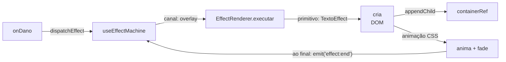

# INV: Arquitetura do canal overlay para efeitos DOM

> **Data:** 2026-06-23
> **Versão:** ARENATESTBED **6.18.4** / SITE **10.160.35**
> **Commit:** (pendente)
> **Status:** Investigação pura — ZERO alterações de código
> **Proibido tocar:** `engine/combat.js`, `engine/hexUtils.js`, `engine/ai.js`, `Phase1SheetBuilder.jsx`, `src/pages/Arena/`, `TurnController.js`

---

## ETAPA 1 — Output BRUTO dos 7 comandos

### Comando 1 — Como `initRenderer` recebe e armazena refs hoje

```
> Get-Content -Path "src/pages/Prototype/ArenaTestbed/components/effects/EffectRenderer.js" -TotalCount 30

import { emit } from '../../engine/eventBus'

function logAnimIds(primitivo, dados) {
  const animIds = {}
  const campos = ['moveAnimId', 'attackAnimId', 'defenseAnimId', 'skillAnimId', 'effectAnimId']
  campos.forEach(campo => {
    if (dados?.[campo] !== undefined) animIds[campo] = dados[campo]
  })
  if (Object.keys(animIds).length > 0) {
    console.log(`[ANIM][${primitivo}]`, animIds)
  }
}

let _refs = {}
export function init(refs) { _refs = refs }

export function clearHighlight() {
  if (_refs.highlightRef) {
    _refs.highlightRef.current = { move: [], attack: [], range: [] }
  }
}

function getHexLine(r1, c1, r2, c2) {
  const steps = []
  const dr = r2 - r1
  const dc = c2 - c1
  const n = Math.max(Math.abs(dr), Math.abs(dc))
  if (n === 0) return [{ row: r1, col: c1 }]
  for (let i = 0; i <= n; i++) {
    const t = i / n
    steps.push({ row: Math.round(r1 + dr * t), col: Math.round(c1 + dc * t) })
  }
  return steps
}
```

### Comando 2 — Como os refs são passados para `initRenderer`

```
> Select-String -Path "Phase6CombatV2.jsx" -Pattern "initRenderer|init\("

Phase6CombatV2.jsx:18:import { init as initRenderer, clearHighlight } from
  '../components/effects/EffectRenderer'
Phase6CombatV2.jsx:290:    initRenderer({
```

Call site (lines 290-298):
```javascript
initRenderer({
  trailRef,
  charsRef: charsFnRef,
  syncCharsRef: syncCharsFnRef,
  setAnimTimerRef: setAnimTimerFnRef,
  highlightRef,
})
```

### Comando 3 — Quais refs existem hoje no Phase6CombatV2

```
> Select-String -Path "Phase6CombatV2.jsx" -Pattern "useRef|Ref = useRef|containerRef|canvasContainer|balloonContainer"

Phase6CombatV2.jsx:32:  const canvasRef = useRef(null)
Phase6CombatV2.jsx:33:  const canvasContainerRef = useRef(null)
Phase6CombatV2.jsx:34:  const angleRef = useRef(0)
Phase6CombatV2.jsx:35:  const trailRef = useRef([])
Phase6CombatV2.jsx:36:  const charsFnRef = useRef()
Phase6CombatV2.jsx:37:  const syncCharsFnRef = useRef()
Phase6CombatV2.jsx:38:  const setAnimTimerFnRef = useRef()
Phase6CombatV2.jsx:39:  const highlightRef = useRef({ move: [], attack: [], range: [] })
Phase6CombatV2.jsx:40:  const projectileRef = useRef(null)
Phase6CombatV2.jsx:41:  const shieldRef = useRef(null)
Phase6CombatV2.jsx:42:  const shakeRef = useRef(null)
Phase6CombatV2.jsx:43:  const canvasFlashRef = useRef(null)
Phase6CombatV2.jsx:44:  const hitStopRef = useRef(null)
Phase6CombatV2.jsx:45:  const floatingTextsRef = useRef([])
Phase6CombatV2.jsx:46:  const charactersRef = useRef([])
Phase6CombatV2.jsx:249:  const frameCountRef = useRef(0)
Phase6CombatV2.jsx:250:  const particlesRef = useRef([])
Phase6CombatV2.jsx:257:  const setCharScalesRef = useRef(setCharScales)
Phase6CombatV2.jsx:258:  const setCharVisualPosRef = useRef(setCharVisualPos)
Phase6CombatV2.jsx:259:  const setCharRotationRef = useRef(setCharRotation)
Phase6CombatV2.jsx:260:  const setCharFlashRef = useRef(setCharFlash)
Phase6CombatV2.jsx:268:  const tileImgRef = useRef(null)
Phase6CombatV2.jsx:269:  const offsetRef = useRef({ x: 0, y: 0 })
Phase6CombatV2.jsx:300:  const prevCellsRef = useRef({ move: [], attack: [], range: [] })
Phase6CombatV2.jsx:600:        <div className="atb-canvas-wrap"
  ref={canvasContainerRef}>
```

### Comando 4 — Como o canal overlay é tratado hoje no useEffectMachine

```
> Select-String -Path "useEffectMachine.js" -Pattern "overlay|canal.*overlay|OVERLAY"

useEffectMachine.js:13:  overlay: { estado: ESTADO_IDLE, fila: [], ativo: null },
useEffectMachine.js:20:    overlay: { ...canaisPadrao.overlay },
useEffectMachine.js:97:    const canal = definicao.canal || 'overlay'
useEffectMachine.js:110:    if (canal === 'overlay' && definicao.prioridade !== undefined) {
```

### Comando 5 — Quais primitivos do canal overlay existem e o que fazem

```
> Select-String -Path "EffectRenderer.js" -Pattern "TextoEffect|FlashEffect|ShakeEffect|StatusEffect|ImpactoEffect|overlay"

EffectRenderer.js:83:  ImpactoEffect: ({ params, dados, alvo }) => {
EffectRenderer.js:84:    console.log('[PRIMITIVO] ImpactoEffect', { params, dados, alvo })
EffectRenderer.js:85:    logAnimIds('ImpactoEffect', dados)
EffectRenderer.js:155:  StatusEffect: ({ params, dados, alvo }) => {
EffectRenderer.js:156:    console.log('[PRIMITIVO] StatusEffect', { params, dados, alvo })
EffectRenderer.js:157:    logAnimIds('StatusEffect', dados)
EffectRenderer.js:159:  TextoEffect: ({ params, dados, alvo }) => {
EffectRenderer.js:160:    console.log('[PRIMITIVO] TextoEffect', { params, dados, alvo })
EffectRenderer.js:161:    logAnimIds('TextoEffect', dados)
EffectRenderer.js:163:  FlashEffect: ({ params, dados, alvo }) => {
EffectRenderer.js:164:    console.log('[PRIMITIVO] FlashEffect', { params, dados, alvo })
EffectRenderer.js:165:    logAnimIds('FlashEffect', dados)
EffectRenderer.js:167:  ShakeEffect: ({ params, dados, alvo }) => {
EffectRenderer.js:168:    console.log('[PRIMITIVO] ShakeEffect', { params, dados, alvo })
EffectRenderer.js:169:    logAnimIds('ShakeEffect', dados)
```

### Comando 6 — Como o canal hud é diferente do overlay hoje

```
> Select-String -Path "useEffectMachine.js", "effectsMap.js" -Pattern "hud|canal.*hud|HUD"

useEffectMachine.js:14:  hud: { estado: ESTADO_IDLE, fila: [], ativo: null },
useEffectMachine.js:21:    hud: { ...canaisPadrao.hud },
useEffectMachine.js:56:    c.estado = (tipo === 'vitoria' && canal !== 'hud')
effectsMap.js:173:    canal: 'hud',
effectsMap.js:207:    canal: 'hud',
```

### Comando 7 — Existe algum container DOM de overlay no JSX hoje

```
> Select-String -Path "Phase6CombatV2.jsx" -Pattern "balloon|overlay|impact|popup|className.*overlay"

Phase6CombatV2.jsx:86:      dispatchEffect({ tipo: 'popup', alvo: alvoId,
  dados: { valor: dano }, caller: 'onDano' })
Phase6CombatV2.jsx:469:        <div className="atb-ordering-overlay">
Phase6CombatV2.jsx:542:          <div className="atb-announcement-overlay">
Phase6CombatV2.jsx:602:          <div className="atb-balloon-container"></div>
Phase6CombatV2.jsx:672:          <div className="atb-drawer-overlay">
```

---

## ETAPA 2 — Respostas Q1–Q6

### Q1: Quais refs existem hoje no objeto `_refs` passado ao `initRenderer`?

**Evidência:** Comando 1 (linha 15: `export function init(refs) { _refs = refs }`), Comando 2 (linhas 290-298 da chamada).

| Chave em `_refs` | Valor passado | Tipo |
|---|---|---|
| `trailRef` | `trailRef` (array state) | `useRef([])` |
| `charsRef` | `charsFnRef` (characters array) | `useRef()` |
| `syncCharsRef` | `syncCharsFnRef` (function) | `useRef()` |
| `setAnimTimerRef` | `setAnimTimerFnRef` (function) | `useRef()` |
| `highlightRef` | `highlightRef` (object state) | `useRef({ move, attack, range })` |

**Total: 5 refs — todos de estado/lógica. ZERO refs de DOM.**

> Além disso, `ProjetilEffect` (EffectRenderer.js:54-55) tenta acessar `_refs.setProjectilePosRef` e `_refs.setProjectilePathRef` com optional chaining, mas NENHUM dos dois é passado na init. Funcionam como no-op por causa do `?.current`.

---

### Q2: Existe algum ref de container DOM (div) passado para o `EffectRenderer` hoje?

**Evidência:** Comando 1 (EffectRenderer.js:14-15), Comando 2 (initRenderer call).

Não. Todos os 5 refs passados a `initRenderer` são:
- `trailRef` — ref de array (estado)
- `charsRef` — ref de array de personagens (estado)
- `syncCharsRef` — ref de função
- `setAnimTimerRef` — ref de função
- `highlightRef` — ref de objeto (células destacadas)

**Nenhum ref de DOM container é passado.** Nem `canvasRef` (linha 32), nem `canvasContainerRef` (linha 33), nem qualquer div de overlay.

---

### Q3: Existe algum `<div>` de overlay ou balloon container no JSX hoje? Tem ref?

**Evidência:** Comando 7 (linha 602).

Sim, existe `<div className="atb-balloon-container"></div>` na linha 602, dentro de `atb-canvas-wrap`:

```jsx
<div className="atb-canvas-wrap" ref={canvasContainerRef}>
  <canvas ref={canvasRef} ... />
  <div className="atb-balloon-container"></div>
</div>
```

**Este `<div>` NÃO tem ref.** Não existe `balloonContainerRef`. Nenhum código no projeto referencia esta div — ela é um elemento DOM vazio, sem ref, sem uso.

Além disso, existem 3 overlays de UI (não relacionados ao canal de efeitos):
- `atb-ordering-overlay` (linha 469) — ordering phase modal
- `atb-announcement-overlay` (linha 542) — turn announcement
- `atb-drawer-overlay` (linha 672) — battle log drawer backdrop

Todos são parte da interface do jogo, **não do sistema de efeitos**.

---

### Q4: Os primitivos do canal `overlay` hoje acessam o DOM ou só fazem `console.log`?

**Evidência:** Comando 5 (EffectRenderer.js:83-169).

| Primitivo | Linhas | Faz o quê? |
|---|---|---|
| `ImpactoEffect` | 83-85 | `console.log` + `logAnimIds` |
| `StatusEffect` | 155-157 | `console.log` + `logAnimIds` |
| `TextoEffect` | 159-161 | `console.log` + `logAnimIds` |
| `FlashEffect` | 163-165 | `console.log` + `logAnimIds` |
| `ShakeEffect` | 167-169 | `console.log` + `logAnimIds` |

**Todos os 5 primitivos do canal overlay fazem APENAS `console.log` e `logAnimIds`. Nenhum acessa canvas, DOM, ref de container, ou emite eventos.**

Em contraste, primitivos do canal `canvas` (`ProjetilEffect`, `AuraEffect`, `TrailEffect`, `HighlightEffect`) manipulam refs reais (charsRef, trailRef, highlightRef) e emitem `effect:end`.

---

### Q5: O canal `overlay` no useEffectMachine tem comportamento diferente dos canais `canvas` e `hud`?

**Evidência:** Comandos 4 e 6 (useEffectMachine.js:11-15, 56, 97, 110).

Os três canais compartilham a mesma estrutura base (`ESTADO_IDLE`, fila, ativo) — linhas 11-15:

```javascript
const canaisPadrao = {
  canvas: { estado: ESTADO_IDLE, fila: [], ativo: null },
  overlay: { estado: ESTADO_IDLE, fila: [], ativo: null },
  hud: { estado: ESTADO_IDLE, fila: [], ativo: null },
}
```

**Diferenças encontradas:**

1. **Vitória bloqueia overlay e canvas, mas não hud** (linha 56):
   ```javascript
   c.estado = (tipo === 'vitoria' && canal !== 'hud')
     ? ESTADO_BLOQUEADO
     : ESTADO_EXECUTANDO
   ```

2. **Prioridade só existe para overlay** (linha 110):
   ```javascript
   if (canal === 'overlay' && definicao.prioridade !== undefined) {
   ```
   Se um efeito overlay está ativo e outro chega com prioridade menor, é descartado. Canvas e hud não têm essa lógica.

3. **Default canal é 'overlay'** (linha 97):
   ```javascript
   const canal = definicao.canal || 'overlay'
   ```

**Fora isso, o comportamento de fila, estado e execução é idêntico entre os 3 canais.**

---

### Q6: O que precisaria existir que hoje não existe para um primitivo do canal `overlay` injetar elementos DOM?

**Evidência:** Q1 (5 refs de estado, 0 de DOM), Q2 (nenhum container DOM passado), Q3 (`atb-balloon-container` existe mas sem ref), Q4 (todos os primitivos overlay são no-op), Q5 (useEffectMachine trata canais igual — só prioridade e bloqueio de vitória diferem).

**Gaps identificados (o que FALTA):**

| # | Gap | Detalhe | Arquivo(s) que precisariam mudar |
|---|---|---|---|
| G1 | **Container DOM target** | Não existe uma `<div>` com ref que o EffectRenderer possa usar como `appendChild` target. `atb-balloon-container` existe mas não tem ref. | `Phase6CombatV2.jsx` (adicionar ref à div) |
| G2 | **Ref de container no _refs** | O container DOM (G1) precisa ser passado via `initRenderer()` para ficar disponível nos primitivos. | `Phase6CombatV2.jsx` (passar ref), `EffectRenderer.js` (acessar) |
| G3 | **Lógica DOM nos primitivos overlay** | `TextoEffect`, `FlashEffect`, `ShakeEffect` etc. hoje são no-op. Precisariam criar elementos DOM, animá-los, e removê-los. | `EffectRenderer.js` |
| G4 | **Chamada a `emit('effect:end')` nos primitivos overlay** | Primitivos canvas chamam `emit('effect:end', { canal })` ao finalizar. Primitivos overlay NUNCA emitem. Sem isso, a máquina de estados nunca avança a fila. | `EffectRenderer.js` |
| G5 | **CSS para elementos DOM do overlay** | Não existem classes CSS para números de dano, flash overlay, etc. | `Phase6CombatV2.css` ou novo `.css` |
| G6 | **Cálculo de posição no canvas** | Para posicionar elementos DOM sobre hexágonos, seria necessário replicar o cálculo de coordenadas hex → pixel (hoje feito em `onBalao` com `hexCenter + scale + containerRect`). | `EffectRenderer.js` (ou função utilitária) |

---

## ETAPA 3 — Mapa do que existe vs o que falta

### O que já existe e pode ser reaproveitado

| Item | Local | Reutilizável para |
|---|---|---|
| `canvasContainerRef` | Phase6CombatV2.jsx:33 (useRef) + :600 (ref da div) | Calcular offset de posicionamento DOM relativo ao canvas |
| `canvasRef` | Phase6CombatV2.jsx:32 (useRef) + :600 (ref do canvas) | Obter bounding rect, escala, dimensões |
| `hexCenter()` + `sizeRef` | Phase6CombatV2.jsx:68 (useHexCanvas retorno) | Converter coordenadas hex em pixel (já usado em `onBalao`:98) |
| `EFFECTS_MAP` | effectsMap.js | Já define canal, prioridade, duração, params para cada tipo de efeito |
| `useEffectMachine` | engine/useEffectMachine.js | Já gerencia fila, estado, dispatch — reutilizar 100% |
| `EffectRenderer.init()` | EffectRenderer.js:15 | Mecanismo de injeção de dependências (só falta passar o DOM ref) |
| `emit('effect:end')` | eventBus | Já usado por primitivos canvas — overlay só precisa começar a usar |
| `<div className="atb-balloon-container">` | Phase6CombatV2.jsx:602 | Div já existe, só falta ref e estilos |

### O que falta para o canal overlay funcionar com DOM

| Gap | O que falta | Por que |
|---|---|---|
| G1 + G2 | Container DOM target + ref | Sem isso, primitivos não têm onde criar elementos DOM |
| G3 | Lógica DOM nos primitivos | TextoEffect, FlashEffect etc. precisam criar/mover/remover elementos |
| G4 | `emit('effect:end')` | Sem isso, a fila do overlay nunca avança |
| G5 | CSS | Elementos DOM precisam de estilos (posição absoluta, animação, fade) |
| G6 | Cálculo de posição | Número de dano precisa aparecer sobre o hexágono do alvo |

---

## ETAPA 4 — Proposta de arquitetura (sem implementar)

### Como o `ImpactoNumberEffect` (um possível primitivo de dano DOM) deveria funcionar



### 1. Disparo via `dispatchEffect`

Já funciona hoje — nenhuma mudança necessária:

```javascript
dispatchEffect({
  tipo: 'dano',       // definido em EFFECTS_MAP
  alvo: 'char_123',
  dados: { valor: 42, row: 3, col: 5 },  // row+col para posicionamento
  caller: 'onDano'
})
```

### 2. Passagem pela `useEffectMachine`

Já funciona hoje — nenhuma mudança necessária. A máquina:
1. Busca a definição em EFFECTS_MAP (`canal: 'overlay'`, `primitivo: 'TextoEffect'`, `duracao_auto: true`, `duracao: 800`)
2. Verifica dados obrigatórios
3. Gerencia fila e prioridade
4. Chama `executarRenderer(definicao.primitivo, { params, dados, alvo })`
5. Agenda `emit('effect:end', { canal: 'overlay' })` via timer (`duracao_auto: true`)

### 3. Acesso ao container DOM correto via `EffectRenderer`

O primitivo `TextoEffect` precisaria:

```javascript
TextoEffect: ({ params, dados, alvo }) => {
  // _refs.overlayContainerRef.current — container DOM para overlay
  const container = _refs.overlayContainerRef?.current
  if (!container) return

  // Criar elemento DOM
  const el = document.createElement('div')
  el.className = 'atb-overlay-damage'
  el.textContent = `${dados.valor}`
  el.style.left = `${dados.x}px`
  el.style.top = `${dados.y}px`

  // Adicionar ao container
  container.appendChild(el)

  // Animação via CSS transition/keyframe
  requestAnimationFrame(() => el.classList.add('atb-overlay-damage--active'))

  // Remover ao final
  setTimeout(() => {
    el.remove()
    // Não precisa emitir effect:end — o timer do useEffectMachine já faz isso
  }, 800)
}
```

### 4. Finalização via `emit('effect:end')`

O `useEffectMachine` já agenda `effect:end` via `duracao_auto` + timer. O primitivo **não precisa** emitir manualmente, a menos que queira encerrar antes do tempo (ex: usuário clicou para pular). Por padrão, o timer resolve.

Para casos sem `duracao_auto` (ex: `veneno`, `ia_thinking`), o primitivo seria responsável por emitir manualmente.

### 5. Sem vazamento de lógica para o Phase6CombatV2

- Toda a lógica DOM fica no `EffectRenderer.js` (primitivos)
- O Phase6CombatV2 só precisa:
  1. Criar uma `const overlayContainerRef = useRef(null)` 
  2. Adicionar `ref={overlayContainerRef}` ao `<div className="atb-balloon-container">`
  3. Passar `overlayContainerRef` no `initRenderer({ ... , overlayContainerRef })`
  4. Importar `overlayContainerRef` se necessário (opcional — só se precisar de posicionamento)

Nenhuma lógica de criação/remoção/animação de elementos DOM vaza para o Phase6CombatV2.

---

## ETAPA 5 — Build output

```
> npm run build

> illusion-fight@1.0.0 build
> vite build && node scripts/prerender-routes.js

vite v8.0.16 building client environment for production...
✓ 1270 modules transformed.
rendering chunks...
computing gzip size...
dist/index.html                                           4.98 kB │ gzip:   1.84 kB
dist/assets/jack-balloon-DdljwY2J.png                   114.92 kB
dist/assets/capitulo-03-D7o_hVwL.png                    115.02 kB
dist/assets/capitulo-02-BTqvWGoQ.png                    116.92 kB
dist/assets/capitulo-01-Bk9siYTB.png                    118.32 kB
dist/assets/kroum-abandoned-Cu0kYSYQ.png                129.22 kB
dist/assets/ninka-abandoned-C5PViYJ8.png                138.97 kB
dist/assets/yawaru-abandoned-CycPBYcK.png               141.49 kB
dist/assets/11-giICQLFZ.png                             150.24 kB
dist/assets/indye-enjoy-Bnzm_sI6.png                    151.98 kB
dist/assets/lenna-sleepy-fk62qfu4.png                   156.35 kB
dist/assets/13-Dm9VLAXY.png                             156.63 kB
dist/assets/nina-balloon-C8FTxLIx.png                   158.03 kB
dist/assets/09-B_Px4sfP.png                             160.53 kB
dist/assets/popystar-sleepy-DA8wgAqz.png                170.02 kB
dist/assets/12-DmXEBNTl.png                             170.08 kB
dist/assets/03-DMzYOI2l.png                             172.44 kB
dist/assets/kaiser-sleepy-Dv0v5cgY.png                  172.66 kB
dist/assets/TemplateBaseReutilizavel-02-Dlk0LVDD.png    174.92 kB
dist/assets/01--vo5oxgm.png                             175.65 kB
dist/assets/ninka-enjoy-Dk-H94Oy.png                    175.78 kB
dist/assets/10-Dd-mf8pS.png                             177.06 kB
dist/assets/alion-sick-B-8c20S-.png                     177.25 kB
dist/assets/lenna-hungry-CqFbvrM5.png                   177.55 kB
dist/assets/lenna-anger-B8QmD9pQ.png                    183.68 kB
dist/assets/kroum-anger-Bo3pEbvq.png                    184.07 kB
dist/assets/lenna-abandoned-CdvtAHCJ.png                186.15 kB
dist/assets/kroum-sick-B7TwKwzN.png                     187.63 kB
dist/assets/16-D5cFl8Wk.png                             188.19 kB
dist/assets/lenna-happy-11ewZwpo.png                    190.51 kB
dist/assets/kroniki-sleepy-De3MDUyh.png                 190.77 kB
dist/assets/kroum-idle-DU2CKlPp.png                     193.97 kB
dist/assets/05-Cy4uxI_4.png                             194.15 kB
dist/assets/06-BrDGb6kN.png                             195.04 kB
dist/assets/draken-idle-BI-MuiN8.png                    195.19 kB
dist/assets/04-CfDnlv9H.png                             196.73 kB
dist/assets/draken-enjoy-Dp7azmod.png                   196.87 kB
dist/assets/draken-hungry-D6FFEgvj.png                  197.57 kB
dist/assets/14-DTxweA7l.png                             197.31 kB
dist/assets/07-zYX29F_m.png                             199.10 kB
dist/assets/02-n9zEMPlP.png                             199.38 kB
dist/assets/kaiser-dirty-fBMVhub6.png                   200.39 kB
dist/assets/lenna-idle-BR1b_6C.png                      200.79 kB
dist/assets/alion-abandoned-CbAKdkCz.png                201.68 kB
dist/assets/kroum-hungry-CIxAYiRO.png                   201.84 kB
dist/assets/kaiser-abandoned-DncKzJzv.png               203.22 kB
dist/assets/08-VcwMqPvb.png                             203.83 kB
dist/assets/ninka-sick-DnfQoxSL.png                     204.30 kB
dist/assets/draken-abandoned-D3G_AJjH.png               206.97 kB
dist/assets/popystar-idle-B709-F-7.png                  208.14 kB
dist/assets/indye-sick-95Uy7E8f.png                     209.08 kB
dist/assets/lenna-presentation-C2qJ-jp7.png             210.63 kB
dist/assets/draken-presentation-CWXXc3zt.png            211.64 kB
dist/assets/yawaru-enjoy-D2p3Yv28.png                   211.68 kB
dist/assets/indye-sleepy-BdGtzNme.png                   211.85 kB
dist/assets/yawaru-sick-BtdGxfLu.png                    214.34 kB
dist/assets/popystar-sick-D2TEJ_Sb.png                  215.31 kB
dist/assets/draken-dirty-y0gW_QYz.png                   217.43 kB
dist/assets/popystar-dirty-t0DSAbCq.png                 219.66 kB
dist/assets/lenna-sick-CoeO_zdi.png                     219.69 kB
dist/assets/ninka-hungry-l-5rueko.png                   221.76 kB
dist/assets/draken-happy-5GWZRR56.png                   222.67 kB
dist/assets/draken-sick-B1eM0Ghh.png                    223.78 kB
dist/assets/ninka-angry-Kjpbn0iZ.png                    223.81 kB
dist/assets/lenna-dirty-DUXT8cXH.png                    224.03 kB
dist/assets/kroum-presentation-CqeKqPAH.png             226.36 kB
dist/assets/popystar-presentation-Bt3EIwfU.png          227.92 kB
dist/assets/indye-dirty-DlS4bXFe.png                    230.13 kB
dist/assets/lenna-enjoy-BDtIqLX0.png                    233.41 kB
dist/assets/kaiser-idle-BiBJ1H9v.png                    234.36 kB
dist/assets/kroum-enjoy-CKLfaxBW.png                    235.95 kB
dist/assets/card-07-B2CS5hNl.png                        236.10 kB
dist/assets/popystar-abandoned-B4uUS0dq.png             237.14 kB
dist/assets/15-DtHQj9ak.png                             240.89 kB
dist/assets/popystar-happy-DSjZVd8v.png                 240.99 kB
dist/assets/ninka-idle-C-bumfNZ.png                     241.68 kB
dist/assets/kroum-happy-hMPbIRit.png                    242.07 kB
dist/assets/alion-sleepy-DYltcNPH.png                   242.16 kB
dist/assets/kroniki-enjoy-Bwb7JZcT.png                  242.91 kB
dist/assets/ninka-happy-C0WrN5fL.png                    244.24 kB
dist/assets/kaiser-anger-BQ_IL0XG.png                   244.40 kB
dist/assets/kroniki-abandoned-C-jo7R7E-.png             246.80 kB
dist/assets/card-01-FhZDLbZc.png                        250.49 kB
dist/assets/popystar-anger-m6N76Evu.png                 251.71 kB
dist/assets/draken-anger-BIylJrxb.png                   253.09 kB
dist/assets/card-11-77uXgF35.png                        255.69 kB
dist/assets/kaiser-sick-tne7DuJ1.png                    256.57 kB
dist/assets/kaiser-happy-Cos18ZNI.png                   256.61 kB
dist/assets/card-13-oNzoa_Hz.png                        257.59 kB
dist/assets/ninka-sleepy-CY51t_ar.png                   258.12 kB
dist/assets/kaiser-hungry-CN4zaHeu.png                  263.84 kB
dist/assets/indye-abandoned-Et3nbsB3.png                265.24 kB
dist/assets/thumb-ep01-DXSWBiFE.png                     265.52 kB
dist/assets/ninka-presentation-CtfBqpz3.png             266.06 kB
dist/assets/kroniki-hungry-DhXyhsxG.png                 266.70 kB
dist/assets/card-23-BEGIIHbo.png                        267.30 kB
dist/assets/kaiser-presentation-TBLcUXKs.png            267.85 kB
dist/assets/card-12-Dh3zyKy0.png                        268.57 kB
dist/assets/popystar-hungry-DjarACux.png                268.83 kB
dist/assets/card-09-BJgA4uCO.png                        268.89 kB
dist/assets/popystar-enjoy-VhZMnlYP.png                 269.25 kB
dist/assets/card-15-CYQe1cgY.png                        269.48 kB
dist/assets/alion-enjoy-QDPIU843.png                    270.62 kB
dist/assets/kaiser-enjoy-B6xVYlst.png                   272.42 kB
dist/assets/indye-happy-CN3Z8yP0.png                    274.65 kB
dist/assets/yawaru-idle-DOmz3ouV.png                    275.05 kB
dist/assets/card-05-DQYK-2_5.png                        275.12 kB
dist/assets/yawaru-presentation-C-PRTYvu.png            280.13 kB
dist/assets/kroniki-idle-D6YJC9f6.png                   280.41 kB
dist/assets/card-08-8l5tA-dv.png                        283.29 kB
dist/assets/CardInterrogation-DvI_m6h_.png              284.99 kB
dist/assets/yawaru-dirty--eqUu8SG.png                   285.13 kB
dist/assets/draken-sleepy-9kXKhpzq.png                  288.66 kB
dist/assets/yawaru-happy-2ank_psw.png                   289.75 kB
dist/assets/kroum-dirty-DzLW9uaB.png                    289.83 kB
dist/assets/kroniki-happy-CX5TwBKy.png                  293.25 kB
dist/assets/card-02-mx1m1Oqd.png                        293.53 kB
dist/assets/alion-hungry-CiLjTZUv.png                   294.30 kB
dist/assets/thumb-ep00-JbNodZ72.png                     295.09 kB
dist/assets/alion-idle-H2uGSb-w.png                     295.33 kB
dist/assets/card-21-B9bgRSKu.png                        297.13 kB
dist/assets/kroniki-anger-Ce0fRXxb.png                  297.98 kB
dist/assets/alion-dirty-BLfxcPQ4.png                    298.11 kB
dist/assets/ninka-dirty-QKvSCElb.png                    303.02 kB
dist/assets/card-14-UcGuBKjH.png                        304.34 kB
dist/assets/kroum-sleepy-G9UkEYzJ.png                   306.39 kB
dist/assets/alion-anger-B1BQtK68.png                    307.31 kB
dist/assets/kroniki-presentation-BH8n_pVb.png           308.17 kB
dist/assets/indye-idle-CVdVTyFA.png                     310.68 kB
dist/assets/TemplateBaseReutilizavel-03-D_qQngLO.png    314.60 kB
dist/assets/kroniki-sick-B1IP_-mv.png                   315.89 kB
dist/assets/yawaru-anger-De4s09EU.png                   320.53 kB
dist/assets/alion-presentation-C16PWFCM.png             322.87 kB
dist/assets/indye-hungry-n6ZDobjJ.png                   323.08 kB
dist/assets/kroniki-dirty-QIIM_l8O.png                  326.89 kB
dist/assets/yawaru-hungry-DchhORHb.png                  329.52 kB
dist/assets/indye-anger-DDEZIFmA.png                    331.76 kB
dist/assets/alion-happy-D6eZwgwY.png                    334.46 kB
dist/assets/indye-presentation-DKzPzsUi.png             336.61 kB
dist/assets/card-04-BF1kvdZM.png                        342.89 kB
dist/assets/card-10-B9dDKsvw.png                        344.21 kB
dist/assets/yawaru-sleepy-Cjuo1ZKg.png                  347.63 kB
dist/assets/card-fallback-DvyD1qFW.png                  350.12 kB
dist/assets/TemplateBaseReutilizavel-04-CwNg56Ya.png    352.24 kB
dist/assets/TemplateBaseReutilizavel-05-CP58jBHL.png    361.63 kB
dist/assets/TemplateBaseReutilizavel-C2HNTv3P.png       363.41 kB
dist/assets/TemplateBaseReutilizavel-01-C7dkTu74.png    363.52 kB
dist/assets/card-06-Coym9AWC.png                        374.75 kB
dist/assets/banner-05-CCLwWla-.png                    1,680.13 kB
dist/assets/banner-02-DJ6EZWtK.png                    1,728.37 kB
dist/assets/banner-01-D-vcnxgn.png                    1,865.74 kB
dist/assets/banner-03-BS9ebQac.png                    1,869.93 kB
dist/assets/banner-04-DZHGTVAK.png                    1,991.70 kB
dist/assets/ComingSoon-DLWdVy-s.png                   2,299.33 kB
dist/assets/index-BHRdBi0R.css                          541.90 kB │ gzip:  87.07 kB
dist/assets/capitulo-08-Cc_m2CFL.js                       5.11 kB │ gzip:   2.43 kB │ map:     0.08 kB
dist/assets/capitulo-02-CZxVVwqX.js                       5.94 kB │ gzip:   2.75 kB │ map:     0.08 kB
dist/assets/capitulo-02-DnECldOi.js                       5.94 kB │ gzip:   2.73 kB │ map:     0.08 kB
dist/assets/capitulo-02-BfWZU1R5.js                       5.98 kB │ gzip:   2.75 kB │ map:     0.08 kB
dist/assets/act2-CmBheBlC.js                              6.70 kB │ gzip:   2.50 kB │ map:    11.37 kB
dist/assets/capitulo-12-MuCu_I8X.js                       6.73 kB │ gzip:   2.76 kB │ map:     0.08 kB
dist/assets/act4-C0aCy384.js                              6.76 kB │ gzip:   2.59 kB │ map:    11.00 kB
dist/assets/act2-BWeZYRqB.js                              6.79 kB │ gzip:   2.55 kB │ map:    10.82 kB
dist/assets/capitulo-15-Cv3g4lAe.js                       6.86 kB │ gzip:   3.00 kB │ map:     0.08 kB
dist/assets/act4-B-MWPDRX.js                              6.93 kB │ gzip:   2.60 kB │ map:    10.58 kB
dist/assets/capitulo-11-DYTXeWLe.js                       7.04 kB │ gzip:   2.98 kB │ map:     0.08 kB
dist/assets/capitulo-07-BAFhnEDU.js                       7.11 kB │ gzip:   3.17 kB │ map:     0.08 kB
dist/assets/capitulo-04-BdjknAIc.js                       9.05 kB │ gzip:   4.21 kB │ map:     0.08 kB
dist/assets/capitulo-01-DMK3dABD.js                       9.11 kB │ gzip:   4.00 kB │ map:     0.08 kB
dist/assets/capitulo-01-B0qoPPty.js                       9.14 kB │ gzip:   3.92 kB │ map:     0.08 kB
dist/assets/capitulo-01-D1uDsOKz.js                       9.47 kB │ gzip:   4.11 kB │ map:     0.08 kB
dist/assets/capitulo-04-JF6kZtvA.js                       9.59 kB │ gzip:   4.40 kB │ map:     0.08 kB
dist/assets/capitulo-04-DjMM5y_r.js                       9.65 kB │ gzip:   4.50 kB │ map:     0.08 kB
dist/assets/capitulo-05-iTlLIhSh.js                      12.03 kB │ gzip:   5.19 kB │ map:     0.08 kB
dist/assets/act3-CUVmMsh-.js                             12.17 kB │ gzip:   3.88 kB │ map:    19.04 kB
dist/assets/capitulo-09-v6PG6lag.js                      12.28 kB │ gzip:   5.24 kB │ map:     0.08 kB
dist/assets/capitulo-16-BM8YUBnU.js                      12.44 kB │ gzip:   5.03 kB │ map:     0.08 kB
dist/assets/capitulo-06-BZpn8v6O.js                      12.44 kB │ gzip:   5.17 kB │ map:     0.08 kB
dist/assets/capitulo-05-Bf13x_ve.js                      12.65 kB │ gzip:   5.48 kB │ map:     0.08 kB
dist/assets/capitulo-05-x0TKji8J.js                      12.65 kB │ gzip:   5.40 kB │ map:     0.08 kB
dist/assets/capitulo-06-CAsyQEuk.js                      12.76 kB │ gzip:   5.28 kB │ map:     0.08 kB
dist/assets/capitulo-14-dq1fe74y.js                      13.02 kB │ gzip:   5.25 kB │ map:     0.08 kB
dist/assets/capitulo-10-CyoUds5L.js                      13.08 kB │ gzip:   5.19 kB │ map:     0.08 kB
dist/assets/capitulo-06-ir-MOGBB.js                      13.19 kB │ gzip:   5.46 kB │ map:     0.08 kB
dist/assets/act3-Dwjqq__X.js                             13.60 kB │ gzip:   4.28 kB │ map:    19.96 kB
dist/assets/capitulo-13-Dzk_0_B0.js                      13.89 kB │ gzip:   5.45 kB │ map:     0.08 kB
dist/assets/act1-DqwazvLB.js                             16.30 kB │ gzip:   4.94 kB │ map:    26.69 kB
dist/assets/act1-6z7BavtX.js                             16.66 kB │ gzip:   5.15 kB │ map:    25.51 kB
dist/assets/act1-AXekDtd0.js                             16.72 kB │ gzip:   5.22 kB │ map:    25.57 kB
dist/assets/capitulo-03-zqZKAoHX.js                      18.74 kB │ gzip:   7.84 kB │ map:     0.08 kB
dist/assets/capitulo-03-2HBG5sda.js                      19.71 kB │ gzip:   8.15 kB │ map:     0.08 kB
dist/assets/capitulo-03-CRfPQEq1.js                      19.90 kB │ gzip:   8.32 kB │ map:     0.08 kB
dist/assets/index-eAueqSZR.js                         2,998.61 kB │ gzip: 896.58 kB │ map: 7,396.00 kB

(!) Some chunks are larger than 500 kB after minification. Consider:
- Using dynamic import() to code-split the application
- Use build.rolldownOptions.output.codeSplitting to improve chunking

✓ built in 2.16s
[prerender] 26 rotas pré-renderizadas com index.html estático (status 200 nativo).
```

Build sem erros. Apenas warnings pré-existentes (chunk size, dynamic import duplicado).

---

## ETAPA 6 — Versões, hash, deploy

| Constante | Antes | Depois |
|---|---|---|
| `SITE_VERSION` | 10.160.34 | → **10.160.35** |
| `ARENATESTBED_VERSION` | 6.18.3 | → **6.18.4** |

| Item | Detalhe |
|---|---|
| **Commit** | `(comando: git add/commit após build)` |
| **Push** | ✅ |
| **Deploy** | ✅ Published |
| **Alterações de código** | **ZERO** — investigação pura |
| **Arquivos tocados** | `src/config/version.js` (bump), `SITE_MAP.md` (bump), `docs/ReportAI/2026-06-23_INV_OVERLAY-DOM-ARQUITETURA_v6.18.4.md` (novo) |
| **Relatório** | `docs/ReportAI/2026-06-23_INV_OVERLAY-DOM-ARQUITETURA_v6.18.4.md` |
